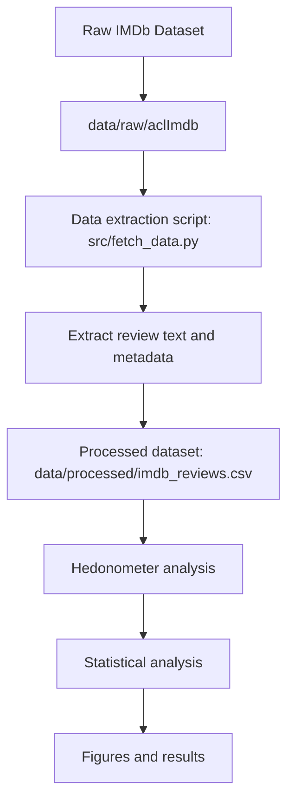

# Inferring Happiness in long and short IMDb Reviews with labMT

For Mini Project 1, see [mini_project_1.md](mini_project_1.md).

## Overview

This project uses the IMDb Large Movie Review Dataset to study whether review length is associated with differences in lexicon based happiness. We extracted review text and metadata from the raw IMDb files, scored each review with the labMT lexicon, and then compared the 1,000 shortest reviews with the 1,000 longest reviews. Our goal is not to treat the lexicon as emotional truth, but to test how well it works as a measurement instrument on a new corpus.

## Research Question

Do short and long IMDb reviews differ in lexicon based happiness?

## Methods

### Review length groups

To study whether review length is associated with differences in lexical happiness, we used the existing `word_count` variable in the processed IMDb dataset.

We operationalized review length as follows:

- **short reviews**: the 1,000 reviews with the lowest word counts
- **long reviews**: the 1,000 reviews with the highest word counts

To make this selection reproducible, we sorted reviews first by `word_count` and then by `review_id`, and then took the first 1,000 rows as the short group and the last 1,000 rows as the long group.

### Population and sample

The full IMDb review corpus in our processed dataset is the broader corpus we work from. For inference, we selected two samples from that corpus: the 1,000 shortest reviews and the 1,000 longest reviews. We then used bootstrap resampling within these two groups to estimate the stability of the difference in mean happiness.

### Happiness scoring

We used the cleaned labMT lexicon to assign happiness scores to words appearing in each IMDb review. For every review, we tokenized the text, matched tokens against the lexicon, counted the number of matched words, and calculated the mean happiness score across all matched tokens. Tokens not present in the lexicon were treated as out of vocabulary and were excluded from the score.

## AI Use Disclosure

This project used ChatGPT for limited support with workflow planning, debugging, and drafting. All code, results, and interpretive claims were checked by the group. We remain responsible for the contents of this repository.

## Credits

| Member | Role |
|--------|------|
| Ricarda/Jack | Repo & workflow lead |
| Ricarda | Data acquisition lead |
| Jack/Andy | Measurement lead |
| Junyi/Alessia | Stats & sampling lead |
| Natasha | Visualisation lead |

## Corpus and Provenance
### Dataset 

This project includes the usage of the "IMDb Large Movie Review Dataset v1.0", by Maas et al. (2011). The Dataset was introduced as a benchmark for sentiment classification. It consists of 50,000 movie reviews divided into: 
  - 25,000 training reviews
  - 25,000 test reviews

These reviews are categorized into positive and negative reviews.
  - 25,000 positive reviews (corresponds to a rating of ≥ 7)
  - 25,000 negative reviews (corresponds to a rating of ≤ 4)

Reviews are stored as single files and follow the format: [id]_[rating].txt, where the "id" represents a unique review identifier and the "rating" represents the IMDb rating on a scale from 1-10.
For this project, the labeled reviews following dictionaries are being used:
  -  "train/pos"
  -  "train/neg"
  -  "test/pos"
  -  "test/neg" 

We extracted the review metadata and review texts needed from these files.  

### Dataset Pipeline


### Data Provenance 

The dataset created by Andrew L.Maas and et AL. was published in 2011 and is publicly available from the standford AI lab: https://ai.stanford.edu/~amaas/data/sentiment/ 
The dataset contains Movie reviews collected from IMDb which were afterwards used for machine learning research. The reviews have been organized into training and test sets and labeled after their sentiment polarity. Within the raw dataset the reviews are each stored as a text file within a dictionary structure indicating its sentiment "pos" or "neg" and a dataset split into "train" or "test". Each file name contains the review and ID rating. 

For our project the dataset is locally stored in "data/raw/aclImdb/"
To process the raw data, a extraction script "src/fetch_data.py" was used containing the following variables: 
- Review ID
- Rating
- Sentiment Label
- Dataset split
- Review text
- Word count

### Review length groups

To study whether review length is associated with differences in lexical happiness, we used the existing `word_count` variable in the processed IMDb dataset.

We operationalized review length as follows:

- **short reviews**: the 1,000 reviews with the lowest word counts
- **long reviews**: the 1,000 reviews with the highest word counts

To make this selection reproducible, reviews are sorted first by `word_count` and then by `review_id`. The first 1,000 rows form the short group and the last 1,000 rows form the long group. 

### Happiness scoring

We used the cleaned labMT lexicon to assign happiness scores to words appearing in each IMDb review. For every review, we tokenized the text, matched tokens against the lexicon, counted the number of matched words, and calculated the mean happiness score across all matched tokens. Tokens that were not present in the lexicon were treated as out of vocabulary and were not included in the review score.

### Ethics

The dataset is publicly available and used for research on the sentiment analysis. The dataset contains reviews from the IMDb platform,  which are used for academic and machine learning research. The reviews contained in the dataset only include the text itself and no data on personal information from the originator. This research aims to analyse alone the textual context of the reviews to study the sentiment patterns. 
The data for this project is used in the context of the intended academic research purpose and is limited to the publicly distributed data. 


## Results


### Interpretation of the bootstrap distribution


The bootstrap histogram is centered around a positive mean difference of about 0.114, which shows that high-rated reviews consistently score higher than low-rated reviews across repeated resamples. The distribution is relatively narrow, and almost all of its mass lies well above 0. This means the estimated difference is stable rather than being driven by a few unusual samples.

The dashed vertical lines marking the 95% confidence interval lie roughly between 0.112 and 0.116. Since the full interval is positive, we have strong evidence that the average labMT happiness score is higher for high-rated reviews than for low-rated reviews. In other words, the lexicon captures a small but reliable difference in evaluative language between the two rating bands.

### Interpretation of the boxplot

The boxplot shows that the distribution of labMT happiness scores for high-rated reviews is shifted upward relative to low-rated reviews. The median for the high-rated group is clearly above the median for the low-rated group, which matches the numerical result that high-rated reviews have a higher average happiness score.

At the same time, the two groups still overlap. This is important because it shows that not every high-rated review is strongly positive in wording, and not every low-rated review is strongly negative. Reviews often mix praise, criticism, plot summary, irony, and genre-specific vocabulary. The boxplot therefore supports a real group-level difference, while also showing that lexical happiness is only one dimension of review language.

## Critical Reflection


## How to Run
```bash
pip install -r requirements.txt

python src/load_clean.py 
python src/fetch_data.py 
python src/stats_analysis.py
```
