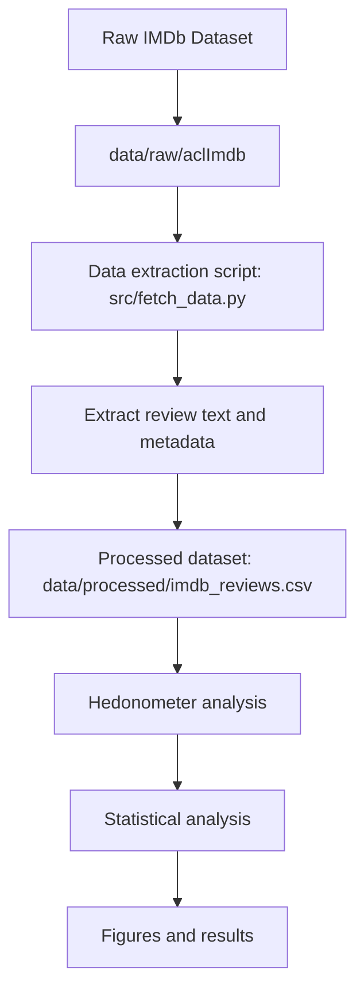
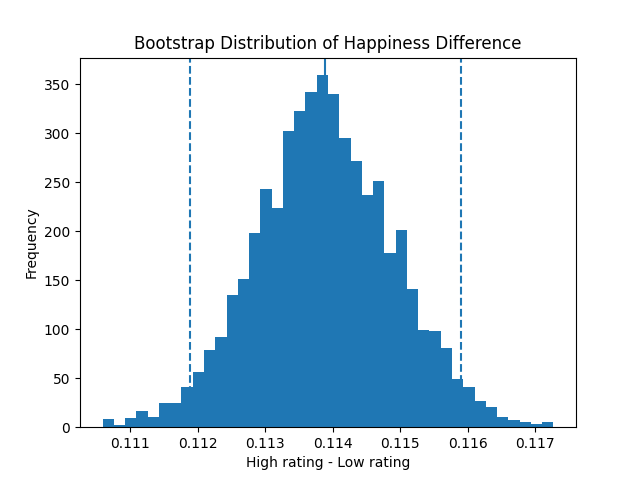
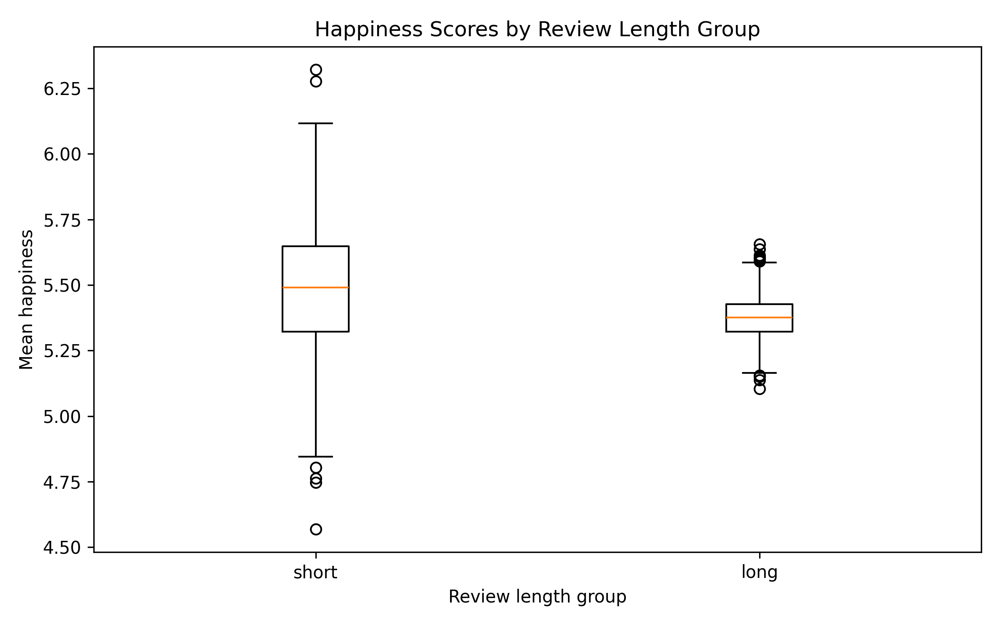

# Inferring Happiness in long and short IMDb Reviews with labMT

For Mini Project 1, see [mini_project_1.md](mini_project_1.md).

## Overview

This project uses the IMDb Large Movie Review Dataset to study how word-level happiness scores from the labMT lexicon varies across review rating bands. We extracted the review text and rating information from the files and used them to compute happiness scores based on the labMT word list. We then compared low-, medium-, and high-rated reviews and estimated uncertainty around these differences. Our goal is not to treat the lexicon as emotional truth, but to test how well it works as a measurement instrument on a new corpus.


## Research Question

Do short and long IMDb reviews differ in lexicon based happiness, and how sigificant is this difference?

## AI Use Disclosure

This project used ChatGPT for limited support with workflow planning, debugging, and drafting. All code, results, and interpretive claims were checked by the group. We remain responsible for the contents of this repository.

## Credits

| Member | Role |
|--------|------|
| Ricarda/Jack | Repo & workflow lead |
| Ricarda | Data acquisition lead |
| Jack/Andy | Measurement lead |
| Junyi/Alessia | Stats & sampling lead |
| Natasha | Visualisation lead |

## Corpus and Provenance
### Dataset 

This project includes the usage of the "IMDb Large Movie Review Dataset v1.0", by Maas et al. (2011). The Dataset was introduced as a benchmark for sentiment classification. It consists of 50,000 movie reviews divided into: 
  - 25,000 training reviews
  - 25,000 test reviews

These reviews are categorized into positive and negative reviews.
  - 25,000 positive reviews (corresponds to a rating of ≥ 7)
  - 25,000 negative reviews (corresponds to a rating of ≤ 4)

Reviews are stored as single files and follow the format: [id]_[rating].txt, where the "id" represents a unique review identifier and the "rating" represents the IMDb rating on a scale from 1-10.
For this project, the labeled reviews following dictionaries are being used:
  -  "train/pos"
  -  "train/neg"
  -  "test/pos"
  -  "test/neg" 

We extracted the review metadata and review texts needed from these files.  

### Dataset Pipeline


### Data Provenance 

The dataset created by Andrew L.Maas and et AL. was published in 2011 and is publicly available from the standford AI lab: https://ai.stanford.edu/~amaas/data/sentiment/ 
The dataset contains Movie reviews collected from IMDb which were afterwards used for machine learning research. The reviews have been organized into training and test sets and labeled after their sentiment polarity. Within the raw dataset the reviews are each stored as a text file within a dictionary structure indicating its sentiment "pos" or "neg" and a dataset split into "train" or "test". Each file name contains the review and ID rating. 

For our project the dataset is locally stored in "data/raw/aclImdb/"
To process the raw data, a extraction script "src/fetch_data.py" was used containing the following variables: 
- Review ID
- Rating
- Sentiment Label
- Dataset split
- Review text
- Word count

This data is kept in a single document: IMDb_reviews_scored.csv, which is used for the analysis of how labMT based happiness varies across IMDb rating bands, and how certain these differences are. 

### Ethics

The dataset is publicly available and used for research on the sentiment analysis. The dataset contains reviews from the IMDb platform,  which are used for academic and machine learning research. The reviews contained in the dataset only include the text itself and no data on personal information from the originator. This research aims to analyse alone the textual context of the reviews to study the sentiment patterns. 
The data for this project is used in the context of the intended academic research purpose and is limited to the publicly distributed data. 

## Methods

### Rating bands

We grouped IMDb reviews into three rating bands using the original numeric `rating` field:

- **low**: ratings 1 to 4
- **medium**: ratings 5 to 6
- **high**: ratings 7 to 10

This grouping gives us a meaningful metadata variable for comparison and supports sampling and inference across review groups.

## Results

We compared labMT-based happiness scores between low-rated IMDb reviews (ratings 1–4) and high-rated IMDb reviews (ratings 7–10). The average happiness score for low-rated reviews was approximately 5.360, while the average for high-rated reviews was approximately 5.474. The observed mean difference (high minus low) was about 0.114.

To assess the stability of this difference, we used bootstrap resampling with 5,000 iterations. The 95% bootstrap confidence interval for the mean difference was approximately [0.1119, 0.1158]. Because this interval does not include 0, the difference is unlikely to be due to random sampling variation alone.

Taken together, these results suggest that high-rated IMDb reviews tend to use slightly more positively weighted vocabulary than low-rated reviews when measured with the labMT lexicon. The difference is small, but it is consistent across resamples.

### Interpretation of the bootstrap distribution



The bootstrap histogram is centered around a positive mean difference of about 0.114, which shows that high-rated reviews consistently score higher than low-rated reviews across repeated resamples. The distribution is relatively narrow, and almost all of its mass lies well above 0. This means the estimated difference is stable rather than being driven by a few unusual samples.

The dashed vertical lines marking the 95% confidence interval lie roughly between 0.112 and 0.116. Since the full interval is positive, we have strong evidence that the average labMT happiness score is higher for high-rated reviews than for low-rated reviews. In other words, the lexicon captures a small but reliable difference in evaluative language between the two rating bands.

### Interpretation of the boxplot



The boxplot shows that the distribution of labMT happiness scores for high-rated reviews is shifted upward relative to low-rated reviews. The median for the high-rated group is clearly above the median for the low-rated group, which matches the numerical result that high-rated reviews have a higher average happiness score.

At the same time, the two groups still overlap. This is important because it shows that not every high-rated review is strongly positive in wording, and not every low-rated review is strongly negative. Reviews often mix praise, criticism, plot summary, irony, and genre-specific vocabulary. The boxplot therefore supports a real group-level difference, while also showing that lexical happiness is only one dimension of review language.

## Critical Reflection

This project explores how a lexicon-based approach can be used to analyze sentiment in IMDb movie reviews. Using the labMT word list, we computed average happiness scores for reviews and compared them across rating bands. The results suggest that higher-rated reviews tend to have higher happiness scores, indicating that the lexicon captures some meaningful differences in language. Bootstrapping was also useful for estimating the uncertainty around these differences.

However, lexicon-based methods have clear limitations. They treat words independently and do not account for context, negation, or sarcasm, which can affect how sentiment is expressed in reviews. In addition, grouping reviews into rating bands may simplify patterns that exist across the full rating scope. Because of these limitations, the results should be interpreted as an evaluation of how well the labMT lexicon works on this dataset rather than a perfect measure of review sentiment.

## How to Run
```bash
pip install -r requirements.txt

python src/load_clean.py 
python src/fetch_data.py 
python src/stats_analysis.py
```
